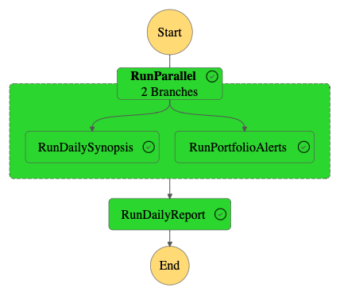

# trading-platform
A platform for monitoring and assessing various trading activities.

Daily reports triggered 15 minutes before the market opens using an AWS State Machine.



Portfolio data are stored in DynamoDB. The reports are saved as PDFs (for 7 days) and accessible via a link sent in an 
email (expires in 24 hours).

This Python project is meant to assist my option-trading endeavors using TD Ameritrade.


## Requirements
- Python 3.8 (due to limitations of TDA package and AWS Lambda)
- TD Ameritrade API key and account id: https://developer.tdameritrade.com
- Alphavantage API key: https://www.alphavantage.co/support/#api-key
- OpenAI API key: https://platform.openai.com/account/api-keys
- Serper API key: https://serper.dev/signup
- Finviz API token: https://elite.finviz.com/api_explanation.ashx
- Set up Telegram bot [Set Up Telegram](#set-up-telegram)
- IAM_ACCESS_KEY_ID and IAM_SECRET_ACCESS_KEY
- GOOGLE_API_KEY and GOOGLE_CSE_ID
    
## Set Up Telegram
### 1. Create a Telegram Bot

1. **Open Telegram**: Start a chat with the *BotFather*, Telegram's bot for creating and managing bots.
2. **Create a New Bot**: Send the `/newbot` command to BotFather.
3. **Set Up Bot**: Follow the prompts from BotFather to name your bot and set a username. The username must end in 'bot' (e.g., `my_alert_bot`).
4. **Get the Token**: After creating the bot, BotFather will give you a token. This token is your bot's API key and is used to authenticate your requests.

### 2. Find Your Telegram User ID

1. **Start a Chat with Your Bot**: Find your bot on Telegram (using the username you set) and start a chat.
2. **Find Your User ID**: Use a service like the `userinfobot` on Telegram to find out your Telegram user ID.


## Set Up
1. Save Alphavantage API key to .env as `ALPHAVANTAGE_API_KEY` for local usage. Save the key to AWS System 
   Manager->Parameter Store as `ALPHAVANTAGE_API_KEY` for AWS Lambda usage.
2. Set Up Amazon Simple Email Service. 
3. Store from email in AWS System 
   Manager->Parameter as `FROM_EMAIL`. Store to emails in AWS System 
   Manager->Parameter as a stringList named `TO_EMAILS`. Use commas to separate emails, no spaces.
4. Build and deploy using SAM, must specify Docker context `DOCKER_ENDPOINT`. Follow [these](https://github.
   com/aws/aws-sam-cli/issues/4329#issuecomment-1732670902) instructions to determine location of host.
    ```bash
    DOCKER_HOST=DOCKER_ENDPOINT sam build --use-container -t template.yaml
    DOCKER_HOST=DOCKER_ENDPOINT sam deploy --guided

    ```
5. Test the API using body and supplying the API key in the header (generated by SAM):
   ```json
    {
        "report_type": "stock_analysis",
        "send_email": true,
        "symbol": "MSFT"
    }
    ```
